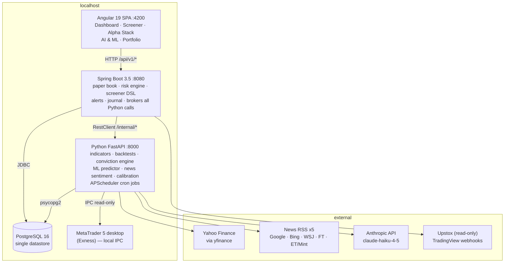

# Trading Platform — Alpha Stack & AI/ML, explained end to end

> Self-contained brief. Assumes no prior knowledge of the codebase.
> A personal NSE (Indian equities) swing-trading platform running entirely on
> localhost, with a paper-trading book, an explainable multi-factor scoring
> engine ("Alpha Stack"), an ML predictor, an LLM news layer, and a
> self-calibration loop that learns whether any of it actually works.

---

## 1. Stack and topology

| Layer | Technology |
| --- | --- |
| Frontend | Angular 19, Angular Material, lightweight-charts, RxJS, TypeScript 5.7 — `:4200` |
| API / domain | Spring Boot 3.5, Java 21, Spring Data JPA, Flyway, Spring Security — `:8080` |
| Analytics | Python, FastAPI + uvicorn, SQLAlchemy 2, pandas, APScheduler — `:8000` |
| Database | PostgreSQL 16 (single Docker container) — `:5432` |
| Cache | **None.** No Redis. LLM results are cached *in Postgres* keyed by a content fingerprint. |

**Write ownership is strict** (one writer per table):

- **Spring owns**: paper account/positions/orders, strategies, alerts, journal, risk settings.
- **Python owns**: prices, indicator snapshots, fundamentals, news, AI insights, conviction history, autopilot attribution.
- Python reads the paper tables **read-only**. Flyway (Spring side) owns *all* DDL for both services.
- The browser never calls Python directly — Angular → Spring → Python.



---

## 2. The Alpha Stack — explainable multi-factor conviction

### 2.1 The core idea

Instead of one opaque model, **seven independent "analysts"** each score a stock,
and their weighted agreement becomes a single **conviction score out of 100**.
Every layer's contribution is visible in the UI, so you can always ask *why* it
said 68.

### 2.2 The scoring contract

Each layer emits a **strength in `[0, 1]`** where **0.5 means neutral or unknown**.
Contribution = `weight × strength`. **Weights sum to exactly 100**, so conviction
*is* a percentage of the best possible setup — not an unbounded points pile.

| Layer | Weight | What it measures |
| --- | ---: | --- |
| `technical` | **25** | Timing — a fired strategy ENTRY signal, or a snapshot "posture" read |
| `quality` | **25** | Business quality from fundamentals (ROE, margins, growth, leverage, valuation) |
| `news` | **18** | Stock-specific news sentiment (also holds the veto) |
| `momentum` | **14** | Relative strength rank vs the whole universe |
| `ml` | **7** | RandomForest next-day direction vote |
| `macro` | **6** | Market-wide news tone (LLM digest of the day's headlines) |
| `regime` | **5** | Market breadth state (RISK_ON … RISK_OFF) |

**Why technical and quality are equal:** a trigger on a bad business and a great
business with no trigger are each *half a thesis*. Neither alone is a trade.

**Why `ml` is only 7:** predicting next-day equity returns is near-noise. The
model is a tiebreaker, not a decision-maker — and it is **ignored entirely**
unless its out-of-sample directional accuracy exceeds 50%.

### 2.3 How each layer computes its strength

```
technical   fired ENTRY signal  -> 0.85, +0.075 per additional agreeing strategy (max 2)
            no signal           -> "posture" read from the snapshot (above/below 200-DMA,
                                   above/below 50-DMA, RSI zone, distance from 52w high),
                                   rescaled into 0..0.70 so posture can NEVER outrank a
                                   real signal
quality     quality_score/100 (0..1); missing fundamentals -> 0.5 neutral
news        news_score_out_of_10 / 10; no digest -> 0.5 neutral
momentum    rs_rank / 100 (percentile vs universe); unknown -> 0.5
ml          UP -> 1.0, DOWN -> 0.0, no usable model -> 0.5   (gated on accuracy > 50%)
macro       positive 1.0 | neutral 0.5 | mixed 0.35 | negative 0.0 | unknown 0.5
regime      RISK_ON 1.0 | PULLBACK 0.65 | CHOP 0.35 | BEAR_RALLY 0.2 | RISK_OFF 0.0
```

`conviction = clamp(Σ weight_i × strength_i, 0, 100)`

### 2.4 The news veto — independent of the score

Certain news states **block sizing entirely**, whatever the conviction:

- today's digest sentiment is `negative`
- two consecutive negative sentiment days (a deteriorating streak)
- a hard-risk catalyst is detected (fraud, regulatory action, legal)

A veto sets the risk multiplier to **0** and the verdict to `VETOED`. This is a
separate gate, not a score penalty — the logic being that some news makes a
position uninvestable regardless of how good the other six layers look.

### 2.5 From conviction to position size

Conviction says *how sure*; two further factors say *how much*:

```
base        conviction >= 75 -> 1.5x | >= 55 -> 1.0x | >= 40 -> 0.5x | else 0
vol_factor  2.5 / ATR%  clamped to [0.6, 1.4]     (inverse-volatility sizing)
data_qual   x0.85 for each missing high-signal input (fundamentals, news digest)

final = min(1.5, base × vol_factor × data_quality)     ... 0 if vetoed
```

**Why volatility scaling:** two names at identical conviction should not carry
identical rupee risk if one is twice as volatile.

**Why the data-quality haircut:** unknown inputs score a neutral 0.5, which would
otherwise let an unresearched stock collect ~35 free points. The caution is
applied to *size* rather than to the score, so the score stays interpretable.

Verdicts: `HIGH` ≥75 · `NORMAL` ≥55 · `SMALL` ≥40 · `STAND_ASIDE` <40 · `VETOED`.

---

## 3. The AI / ML components

There are **three distinct things** wearing the "AI" label. Keeping them apart is
most of the understanding.

### 3.1 The ML predictor (classical ML)

- **Model**: `RandomForestRegressor`, 200 trees, `min_samples_leaf=5`, one model **per stock**.
- **Target**: next-day percentage return (`close.pct_change().shift(-1)`).
  Direction is derived: `> +0.05% -> UP`, `< -0.05% -> DOWN`, else `FLAT`.
- **10 features**, all price/volume derived: returns over 1/2/5/10 days, RSI(14),
  MACD histogram normalised by price, volume vs 20-day average, price÷SMA20,
  price÷SMA50, distance from the 52-week high.
- **No lookahead**: every feature at bar *T* uses only data up to *T*.
- **Chronological 80/20 split** — never a random split. Random splits on time
  series leak the future backwards and produce flattering, meaningless accuracy.
- Refits on 100% of data for the live prediction. Models are not persisted; a
  ~500-row fit takes seconds.
- **Honest expectation**: 50–53% directional accuracy. That is the real difficulty
  of the problem, not a bug. Sub-50% models are excluded from conviction.

### 3.2 The LLM layer (Claude) — news understanding

- **Model**: `claude-haiku-4-5` via the Anthropic Messages API (no SDK, plain HTTP).
- **Per-stock digest**: headlines → `{summary, sentiment, key_points, watch_for, catalysts[]}`.
- **Market-wide digest**: the day's macro headlines → `{sentiment, stance, key_events, risk_flags}`.
- **Caching**: results stored in `ai_insights`, keyed by a **fingerprint of the
  input headlines**. Regenerated only when the underlying news changes — so each
  insight is paid for once. Token cost is tracked per feature in `ai_usage`.
- **Critical rule**: conviction scoring **never** calls an LLM. It reads only the
  cached digest. This keeps ranking fast, deterministic, and free to re-run.
  (One scoped exception: analysing a *single* stock on demand will warm its digest first.)

**News sourcing** — one provider was too fragile, so it fans out and merges:

1. yfinance news API 2. Google News RSS (India) 3. Bing News RSS 4. Yahoo per-symbol RSS

Then a **relevance gate** before storage: a headline must contain the ticker, or
the company's leading name tokens as a *consecutive phrase* (prefix-matched, so
"Sun Pharma" matches "Sun Pharmaceutical Industries"). Adjacency matters — it is
what stops "Bajaj Housing Finance" being filed under "Bajaj Finance". Cross-source
duplicates collapse by normalised title.

The composite **news layer** blends: base sentiment + catalyst weights + article
velocity (a spike vs the 7-day baseline) + sentiment trend, mapped to a 0–10 score
(5 = neutral) and a veto flag.

### 3.3 The calibration loop (the self-correcting part)

**The problem it solves:** the weights `25/25/18/14/7/6/5` were *asserted by a
human and never validated*. The loop checks them against reality.

```
Phase 0  Every trading day, snapshot EVERY active symbol's conviction and all
         seven layer strengths into `conviction_history`.
Phase 1  Once enough bars pass, label each row with forward returns
         (5 / 10 / 20 day) plus best/worst excursion (MFE/MAE).
Phase 2  Diagnostics: per-layer Information Coefficient, a calibration curve by
         conviction band, and a veto audit.
Phase 3  Ridge regression of forward return on the seven strengths -> suggested weights.
Phase 4  Display suggestions. NEVER auto-apply.
```

**Design decisions that keep it honest:**

- **Record every symbol, not just signalled ones.** Signalled setups all have
  technical strength ≈0.85–1.0 — no variance — and *you cannot estimate the weight
  of a feature that never varies*. The non-signal rows make the regression identifiable.
- **No backfill is possible.** Conviction depends on the cached news digest and
  regime *as they were that day*; re-scoring history would match today's news to
  yesterday's prices — a lookahead bug producing beautiful fake results.
- **Walk-forward validation only** (train past, test future), never random splits.
- **Hard gates**: diagnostics at 30 labelled rows, weight suggestions at 200.
- **Shrinkage**: `suggested = 0.7 × current + 0.3 × learned`. The prior encodes
  trading logic; a few hundred samples encode mostly noise.
- **"No evidence" is a valid output.** If a coefficient's confidence interval
  spans zero, the weight is left alone.
- **Linear on purpose.** The scoring formula is a weighted sum, so ridge
  coefficients map straight back onto readable weights. A gradient-boosted model
  would fit better and be useless for the actual question.

**Interpreting the Information Coefficient:** IC is the rank correlation between a
layer's strength and forward return. In equities **0.03–0.05 is genuinely useful
and 0.10+ is strong** — the intuition that a "good" correlation is 0.7 does not
apply.

### 3.4 The paper autopilot (validating on money, not correlation)

Forward returns measure whether the *signal* predicts. They say nothing about
whether the *system* is profitable — a real trade also has size, a stop, an exit
and a capital limit.

- Daily: rank live setups, skip vetoed and already-held names, take conviction
  **≥55** up to **8 concurrent** positions.
- Size via the risk engine × conviction multiplier; attach an **ATR-based stop**
  (2.5×ATR) and a **2R target**.
- Each entry stores a **copy** of the conviction and all seven layer strengths →
  realised P&L is attributable back to the score that opened it.
- **Paper only** (no live code path), **off by default**, and it places orders
  through Spring's paper API so Spring remains the sole writer of the book.

The headline question it answers: *did the 75+ band actually out-earn 55–75 in
rupees?* If not, the score isn't translating into money — and no reweighting fixes that.

---

## 4. Daily automated cycle

```
Post-market (18:30 IST, weekdays)
  1. Sync OHLCV from Yahoo
  2. Recompute indicator snapshot (SMA/EMA/RSI/MACD/BB/ATR/52w, Ichimoku, swing support)
  3. Evaluate alerts
  4. Evaluate strategy signals (ENTRY / EXIT)
  5. Record conviction for every symbol   <- training data, cannot be backfilled
  6. Label matured conviction rows with forward returns
  7. Paper autopilot: open/reconcile trades (only if explicitly enabled)

Pre-market (08:45 IST, weekdays)
  1. Refresh market-wide news feeds -> macro digest
  2. Refresh per-stock news for signalled/held names
  3. Build the morning briefing (Guardian actions + regime + signals, AI-narrated)
```

---

## 5. Deliberate constraints worth knowing

- **No auto-trading with real money.** Broker integrations (Upstox, Exness/MT5)
  are strictly read-only — no order, modify or close functions exist in those modules.
- **Scoring never blocks on an LLM.** Cached digests only.
- **Conviction is always explainable** — the seven contributions are returned with
  every score and rendered in the UI.
- **Missing data is neutral (0.5), never zero.** Absence of evidence is not
  evidence of weakness; the caution is applied to position size instead.
- **FX/crypto are deliberately NOT conviction-scored.** ~70 of the 100 weight is
  equity fundamentals, NSE relative strength and Indian-market regime, none of
  which mean anything for EURUSD. That surface gets risk monitoring and
  closed-trade analytics only.

---

## 6. Current maturity

| Component | State |
| --- | --- |
| Alpha Stack scoring | Production, ~280 backend tests passing |
| News multi-source + relevance gate | Production |
| ML predictor | Production; accuracy is honestly ~50–53% |
| Conviction recording + labelling | Built; **data accrues from first run** |
| Calibration diagnostics | Built; unlocks at 30 labelled rows (~4–6 weeks) |
| Learned weight suggestions | Built; gated at 200 rows (~3 months) |
| Paper autopilot | Built; **off by default** |
